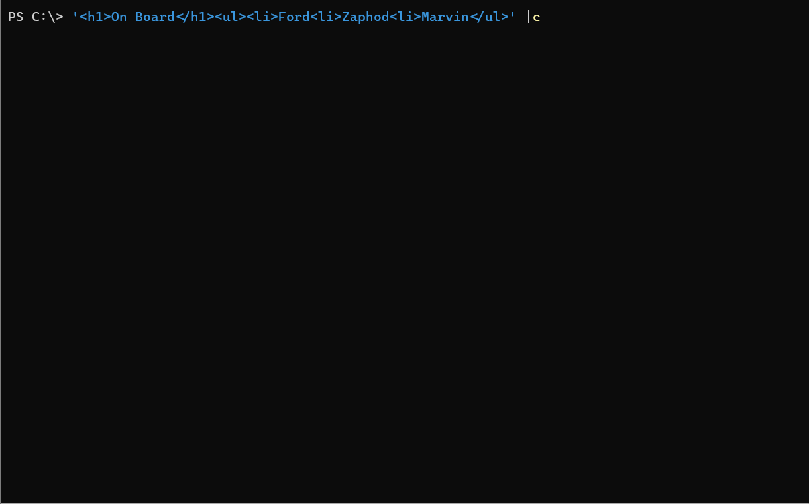

HtmlToMarkdown
==============

<!-- To publish to PowerShell Gallery, commit an update to the .psd1 file -->

<!-- Optional badges: -->

Converts HTML to Markdown/CommonMark using [ReverseMarkdown](https://github.com/mysticmind/reversemarkdown-net),
which uses the [HTML Agility Pack](https://html-agility-pack.net/).

To install: `Install-Module HtmlToMarkdown`

Cmdlets
-------

Documentation is automatically generated using [platyPS](https://github.com/PowerShell/platyPS) (`.\doc.cmd`).

- [Convert-HtmlToMarkdown](docs/Convert-HtmlToMarkdown.md)

Tests
-----

Tests are written for [Pester](https://github.com/Pester/Pester) (`.\test.cmd`).
